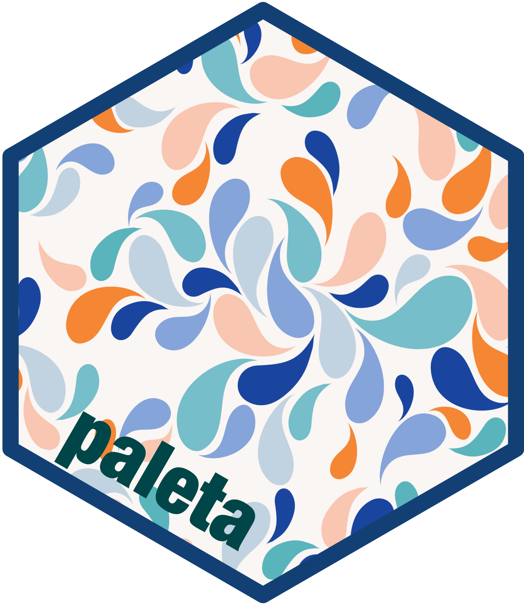

<!-- README.md is generated from README.Rmd. Please edit that file -->

# motif: Collection of Palettes, Themes, and Theme Components 

<!-- badges: start -->

[](https://www.repostatus.org/#wip)
[](https://lifecycle.r-lib.org/articles/stages.html#experimental)
[](https://github.com/katilingban/motif/actions/workflows/R-CMD-check.yaml)
[](https://app.codecov.io/gh/katilingban/motif?branch=main)
[](https://www.codefactor.io/repository/github/katilingban/motif)
<!-- badges: end -->

A collection of palettes, themes, and theme components based on publicly
available branding guidelines of various non-governmental organisations,
government agencies, and United Nations units.

## What does `motif` do?

`motif` provides or will be providing utilities for applying the visual
identity and/or branding guidlines of various non-governmental
organisations, government agencies, and United Nations units.

Currently, `motif` has colours, palettes, and `ggplot2` themes based on
the following organisations’ branding/visual identity guidelines:

- [Africa CDC](https://africacdc.org/) [visual identity
  guidelines](https://africacdc.org/download/visual-identity-africa-cdc-branding-guide/).

Additional colours, palettes, and themes will be provided over time.

## Installation

`motif` is not yet available on [CRAN](https://cran.r-project.org) but
can be installed through the [Katilingban R
universe](https://katilingban.r-universe.dev) resository as follows:

``` r
install.packages(
  "motif", 
  repos = c(
    'https://katilingban.r-universe.dev', 
    'https://cloud.r-project.org'
  )
)
```

## Usage

- [Using the Africa CDC colours, palettes, and
  themes](https://katilingban.io/motif/articles/africa-cdc.html)

## Community guidelines

Feedback, bug reports and feature requests are welcome; file issues or
seek support [here](https://github.com/katilingban/motif/issues). If you
would like to contribute to the package, please see our [contributing
guidelines](https://katilingban.io/motif/CONTRIBUTING.html).

This project is released with a [Contributor Code of
Conduct](https://katilingban.io/motif/CODE_OF_CONDUCT.html). By
participating in this project you agree to abide by its terms.
