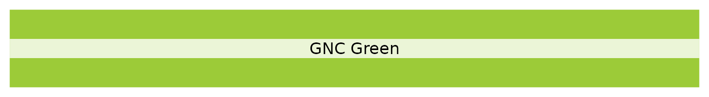
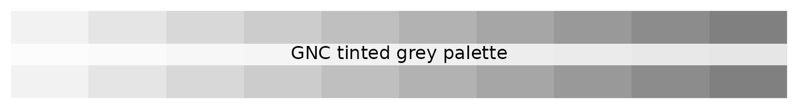
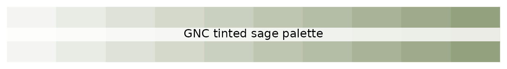
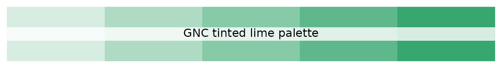
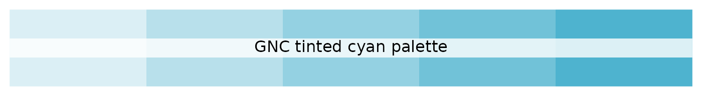
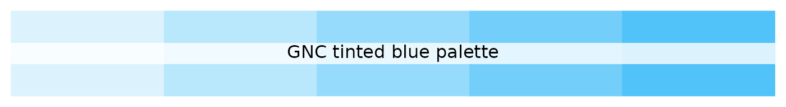
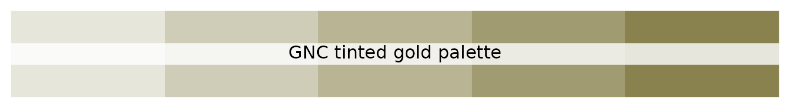

# Global Nutrition Cluster Colours, Palettes, and Themes

The Global Nutrition Cluster (GNC) is a coordination mechanism that
supports nutrition responses in humanitarian emergencies. It is one of
the clusters established by the Inter-Agency Standing Committee (IASC)
to ensure effective and efficient humanitarian responses across various
sectors, including nutrition.

## GNC colours

GNC main colour is the **GNC Green**.

Complementing **GNC Green** is a set of 10 secondary colours.

## GNC palettes

In addition to the primary and secondary colours, a set of tinted
palettes for each of the GNC primary and secondary colours is available.

### Tinted green palette

### Tinted grey palette

### Tinted sage palette

### Tinted dark green palette

### Tinted lime palette

### Tinted aqua green palette

### Tinted cyan palette

### Tinted blue palette

### Tinted orange palette

### Tinted moss green palette

### Tinted gold palette

## GNC `ggplot2` theme

A GNC `ggplot2` theme function called
[`theme_gnc()`](http://katilingban.io/paleta/dev/reference/theme_unicef.md)
is included in the `paleta` package. Following are examples of how it
can be used.

