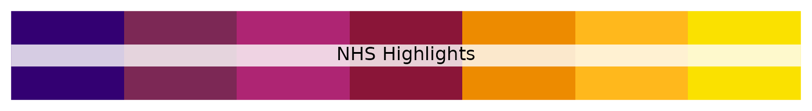

# NHS Colours, Palettes, and Themes

The NHS (National Health Service) is the publicly funded healthcare
system in the United Kingdom. Established in 1948, it provides
comprehensive healthcare services that are largely free at the point of
use for residents of the UK. The NHS is funded primarily through
taxation and is based on the principle of equity, aiming to provide
healthcare services based on need rather than the ability to pay.

The NHS covers a wide range of healthcare services, including general
practitioner (GP) services, hospital care, mental health services,
dental care, and public health initiatives. It operates through a
network of hospitals, clinics, GP surgeries, and other healthcare
facilities across England, Scotland, Wales, and Northern Ireland.

## NHS colours

### Core colours

The core NHS colours are blue and white:

This is supplemented by four additional groups of colours. All colours
in the palette meet at least an AA accessibility rating, with many
achieving the highest AAA rating when used with appropriate contrasts on
suitable backgrounds.

### Level 1: Blue tones

Level 1 of the NHS colour palette consists of various shades of blue,
emphasizing the association with blue and white. It provides lighter and
darker alternatives to the main NHS Blue colour, offering tonal variety
while maintaining the core brand identity.

### Level 2: Neutrals

These additional colours complement the primary blues in the palette.
Black and dark grey are suitable for text depending on the context.
Lighter greys can serve as backgrounds, especially online. White serves
as the primary neutral base. Proper use of these colours enhances the
overall blue and white aesthetic.

### Level 3: Support Greens

Green, being closely related to blue in the colour spectrum, complements
the blue and white palette. When used moderately and in a supporting
role, it maintains the association with blue and white without
compromising it. However, if green becomes too dominant, it may hinder
people’s ability to instantly recognize the NHS as the source of
information.

### Level 4: Highlights

Highlights are effective for emphasizing details, adding warmth to the
blue theme, and offering accent colours for NHS entities to distinguish
themselves. However, excessive use can drastically alter the overall
appearance and disassociate the communication from the NHS brand.
Therefore, it’s advised to use highlights sparingly and avoid large
blocks of these colours.

## NHS sequential brewer palettes

### Blues

### Blue to green

### Blue to purple

### Green to blue

### Greens

### Greys

### Purple to blue

### Purple to blue to green

### Purple to red

### Red to purple

### Reds

### Yellow to green

### Yellow to green to blue

### Yellow to orange to red

## NHS divergent brewer palettes

### Pink to yellow to green

### Purple to green

### Purple to orange

### Red to blue

### Red to grey

### Red to yellow to blue

### Red to yellow to green

## Africa CDC qualitative palettes

### Pastel set 1

### Dark

## NHS `ggplot2` theme

An NHS `ggplot2` theme function called
[`theme_nhs()`](http://katilingban.io/paleta/dev/reference/theme_nhs.md)
is included in the `paleta` package. Following are examples of how it
can be used.

