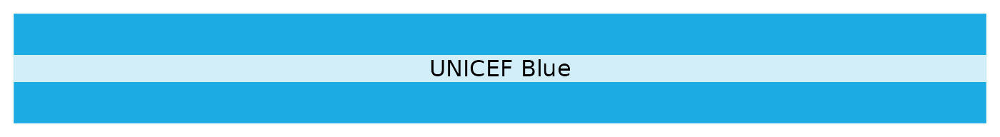

# UNICEF Colours, Palettes, and Themes

UNICEF, which stands for the United Nations International Children’s
Emergency Fund, is a specialized agency of the United Nations dedicated
to improving the lives and well-being of children worldwide. Established
in 1946, UNICEF works in over 190 countries and territories to provide
healthcare, nutrition, clean water, education, protection from violence
and exploitation, and emergency assistance to children and their
families. It operates on the principle that every child deserves a fair
chance in life, regardless of their background or circumstances, and
strives to uphold children’s rights as outlined in the Convention on the
Rights of the Child.

## UNICEF colours

UNICEF main colour is the iconic **UNICEF Blue**.

Complementing **UNICEF Blue** is a set of 11 secondary colours.

The secondary colours can be further subdivided into a set of 5 bright
colours and a set of 6 neutral colours.

## UNICEF `ggplot2` theme

A UNICEF `ggplot2` theme function called
[`theme_unicef()`](http://katilingban.io/paleta/dev/reference/theme_unicef.md)
is included in the `paleta` package. Following are examples of how it
can be used.

